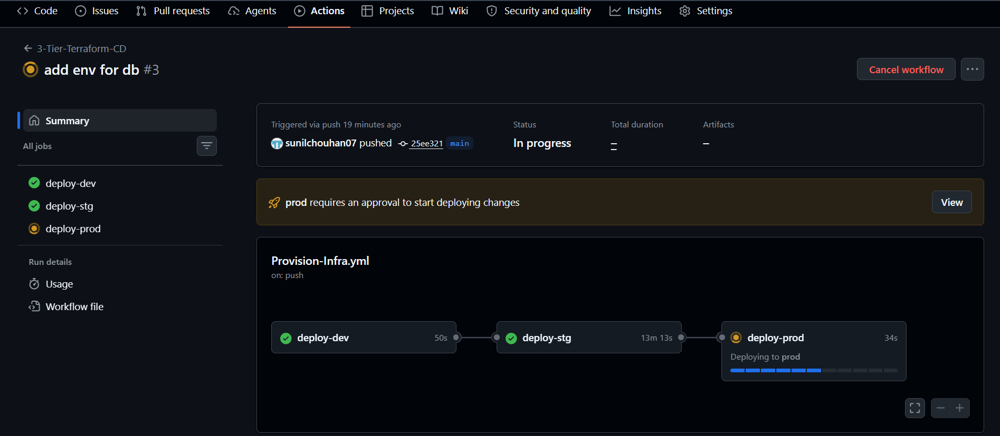
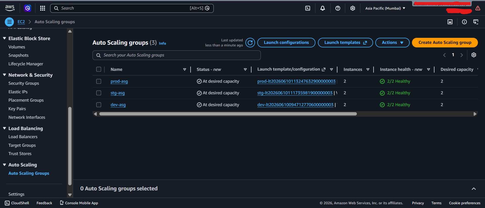
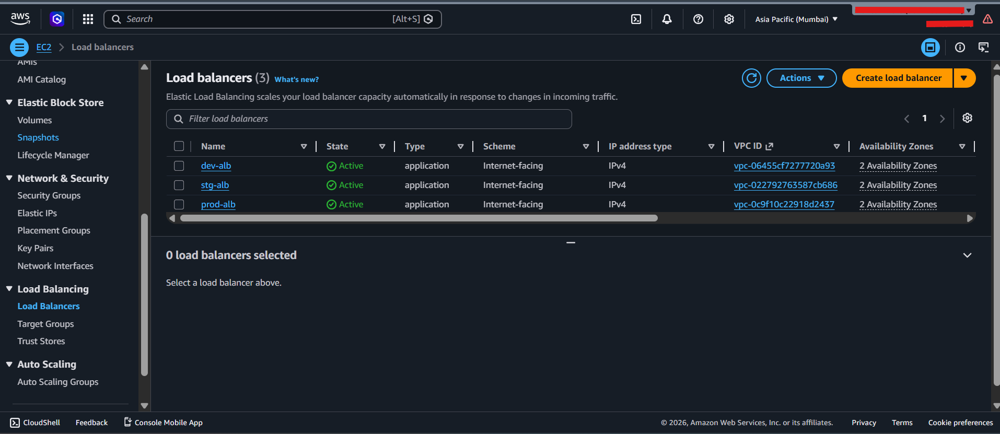
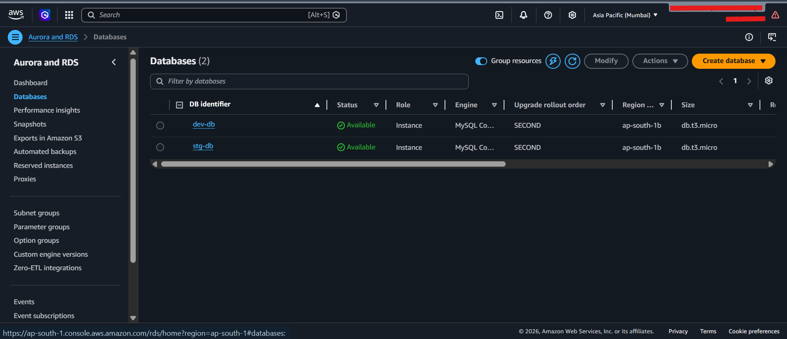
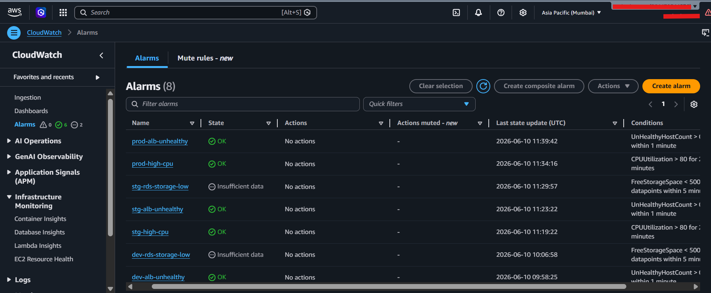
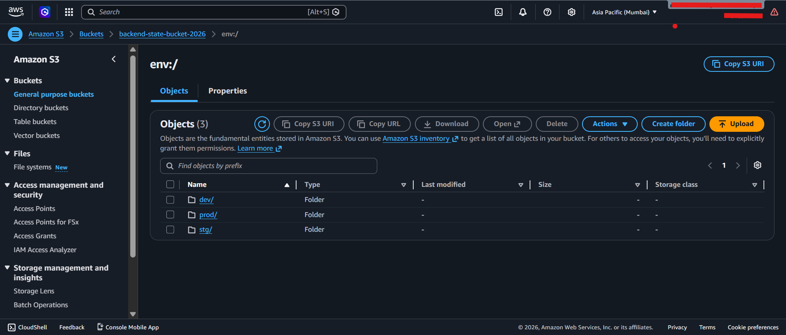

# 🚀 3-Tier Terraform CI/CD Infrastructure on AWS

This repository provisions and manages a **3-tier architecture (Dev, Staging, Prod)** on AWS using **Terraform** and **GitHub Actions**.  
It demonstrates **Infrastructure as Code (IaC)**, **automated CI/CD pipelines**, and **scalable cloud-native deployments** with monitoring and observability.

---

## 📐 Architecture Overview


The infrastructure is designed with **high availability, scalability, and observability** in mind:

- **VPC** with public & private subnets across multiple Availability Zones  
- **Application Load Balancer (ALB)** for traffic distribution  
- **Auto Scaling Groups (ASG)** with EC2 instances for compute layer  
- **Amazon RDS (MySQL)** for persistent database storage  
- **S3 Backend** for Terraform state management  
- **CloudWatch Alarms & Logs** for monitoring and alerting  

---

## ⚙️ CI/CD Workflow



GitHub Actions automates provisioning across environments:

1. **CI Pipeline (Validate-Infra.yml)**  
   - Runs on PRs  
   - Executes `terraform init`, `terraform validate`, and `terraform plan`  
   - Ensures code quality before merging  

2. **CD Pipeline (Provision-Infra.yml)**  
   - Runs on `main` branch push  
   - Deploys sequentially: **Dev → Staging → Prod**  
   - Requires **manual approval** before Prod deployment  
   - Stores Terraform plans as artifacts (`tfplan-dev`, `tfplan-stg`, `tfplan-prod`)  

---

## 📊 AWS Console Snapshots

### EC2 Auto Scaling Groups


- Separate ASGs for **dev**, **stg**, and **prod**  
- Each group maintains desired capacity with health checks  
- Ensures resilience and scaling across AZs  

---

### Load Balancers


- Internet-facing ALBs for each environment  
- Distributes traffic across healthy EC2 targets  
- Integrated with CloudWatch alarms for health monitoring  

---

### RDS Databases


- MySQL Community Edition for **dev** and **stg**  
- Configured with subnet groups for high availability  
- Managed backups and monitoring enabled  

---

### CloudWatch Alarms


- CPU utilization alarms for EC2 instances  
- Storage alarms for RDS  
- ALB unhealthy host alarms for traffic resilience  

---

### S3 Backend


- Stores Terraform state files per environment (`dev/`, `stg/`, `prod/`)  
- Ensures consistency and collaboration with DynamoDB locking  

---

## 📂 Repository Structure

``` 

.github/workflows/   → GitHub Actions pipelines
docs/architecture/   → Diagrams & screenshots
terraform/
├── backend/       → Remote state configuration
├── modules/       → Reusable modules (VPC, ALB, ASG, RDS, Monitoring)
├── *.tf           → Root module configs
└── terraform.tfvars → Environment variables
README.md            → Project documentation


Code

```

---

## 🚀 Deployment Steps

### Prerequisites
- AWS account with IAM permissions  
- Terraform ≥ 1.5  
- GitHub repository secrets configured:
  - `AWS_ACCESS_KEY_ID`
  - `AWS_SECRET_ACCESS_KEY`
  - `AWS_REGION`

### Usage


```bash
# Initialize backend
terraform init

# Validate configuration
terraform validate

# Plan infrastructure
terraform plan -var-file=terraform.tfvars

# Apply changes
terraform apply -var-file=terraform.tfvars

```


### 📊 Monitoring & Observability
CloudWatch Alarms for CPU, RDS storage, and ALB health


Grafana + Prometheus + Loki (optional) for advanced metrics/logs


Auto Scaling Groups ensure resilience and cost efficiency


### 🛡️ Best Practices Implemented

✅ Modular Terraform code for reusability

✅ Remote state management with S3 + DynamoDB locking

✅ Multi-environment separation (Dev, Stg, Prod)

✅ Approval gates before production rollout

✅ GitOps-ready with ArgoCD integration


### 📖 Documentation
Architecture diagrams available in docs/architecture/

Workflow screenshots included for CI/CD visualization

Example alarms, load balancers, and RDS setup shown in AWS console


# 👨‍💻 Author

## Sunil Chouhan  
### Cloud & DevOps Engineer in training | AWS | Kubernetes | Terraform | CI/CD

## ⭐ Contributing
Contributions are welcome! Fork the repo, create a feature branch, and submit a PR.