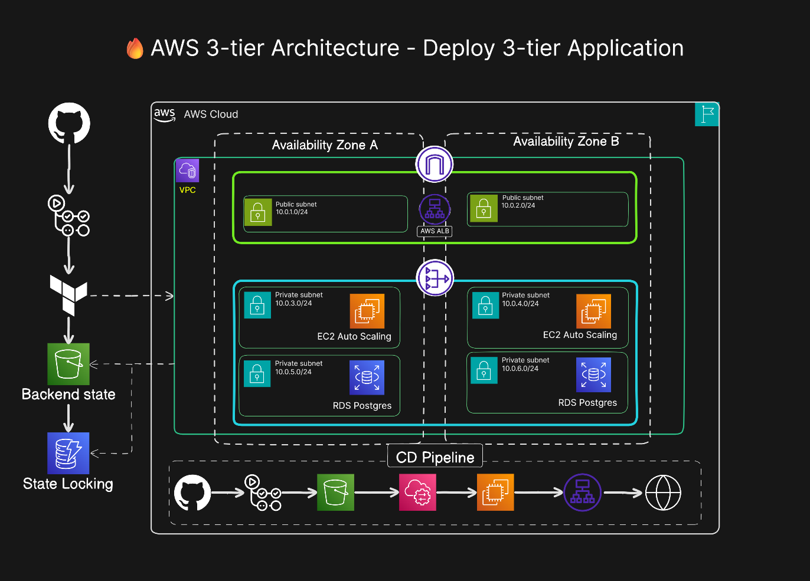

# 🚀 AWS 3-Tier Infrastructure on AWS using Terraform


Production-ready **AWS 3-Tier Infrastructure** built with **Terraform**.

This repository provisions the complete infrastructure required to host scalable web applications on AWS. It follows Infrastructure as Code (IaC) best practices and prepares EC2 instances for automated deployments.


                            

> **Note**
>
> This repository provisions infrastructure only.
>
> Application deployment is handled separately by:
>
> 🔗 employee-management-system  

---

# Architecture



## Infrastructure Components

- Amazon VPC
- Public & Private Subnets (2 AZ)
- Internet Gateway
- NAT Gateway
- Route Tables
- Application Load Balancer
- Auto Scaling Group
- Launch Template
- EC2 Instances
- IAM Roles
- Security Groups
- Amazon RDS PostgreSQL
- Amazon S3
- DynamoDB
- AWS Systems Manager (SSM)

---

# Repository Purpose

This repository is responsible for:

- Provisioning AWS Infrastructure
- Creating networking resources
- Creating EC2 Auto Scaling Groups
- Creating Application Load Balancer
- Creating PostgreSQL Database
- Creating IAM Roles
- Creating S3 backend
- Creating DynamoDB locking table
- Bootstrapping EC2 instances
- Preparing servers for application deployments

This repository **does not deploy application code.**

---

# EC2 Bootstrap

EC2 instances are automatically configured using **Terraform User Data**.

During instance launch the bootstrap script installs and configures:

- AWS CLI v2
- Node.js
- PM2
- Nginx
- Amazon SSM Agent
- Deployment directories
- Backend environment file
- Reverse proxy configuration

After provisioning every EC2 instance is immediately ready to receive deployments through AWS Systems Manager.

---

# Infrastructure Architecture

```
                    Internet
                        │
                Application Load Balancer
                        │
        ┌───────────────┴───────────────┐
        │                               │
   EC2 Auto Scaling               EC2 Auto Scaling
     Private Subnet                Private Subnet
        │                               │
        └───────────────┬───────────────┘
                        │
                  PostgreSQL RDS
                   Private Subnets
```

---

# Deployment Architecture

Infrastructure Repository

```
GitHub
    │
Terraform
    │
AWS Infrastructure
```

Application Repository

```
GitHub
      │
GitHub Actions
      │
Build Application
      │
Create ZIP Artifact
      │
Upload Artifact to Amazon S3
      │
AWS Systems Manager
      │
EC2 Downloads Latest Artifact
      │
PM2 Restart
      │
Nginx Reload
      │
Application Available via ALB
```

---

# Repository Structure

```text
.
├── .github/
│   └── workflows/          # GitHub Actions workflows
├── docs/                   # Architecture diagrams and screenshots
├── terraform/
│   ├── backend/            # Remote backend configuration
│   ├── modules/
│   │   ├── app_lb/         # Application Load Balancer
│   │   ├── asg/            # Auto Scaling Group
│   │   ├── rdsInstance/    # PostgreSQL RDS
│   │   ├── s3/             # S3 resources
│   │   └── vpc/            # Networking
│   ├── albmain.tf
│   ├── asgmain.tf
│   ├── backend.tf
│   ├── data.tf
│   ├── locals.tf
│   ├── output.tf
│   ├── provider.tf
│   ├── rdsmain.tf
│   ├── s3.tf
│   ├── terraform.tfvars
│   ├── variable.tf
│   └── vpcmain.tf
├── README.md
└── .gitignore
```

---

# Terraform Backend

Terraform state is stored remotely.

- Amazon S3
- DynamoDB State Locking

Benefits

- Team Collaboration
- State Locking
- Versioned State
- Prevents State Corruption

---

# AWS Services Used

- Amazon VPC
- EC2
- Launch Templates
- Auto Scaling Group
- Application Load Balancer
- IAM
- Amazon RDS PostgreSQL
- Amazon S3
- DynamoDB
- AWS Systems Manager
- CloudWatch

---

# Prerequisites

- Terraform >= 1.6
- AWS CLI
- AWS Account
- IAM User / IAM Role

---

# Deployment

Initialize Terraform

```bash
terraform init
```

Validate

```bash
terraform validate
```

Plan

```bash
terraform plan
```

Apply

```bash
terraform apply
```

Destroy

```bash
terraform destroy
```

---

# Related Repository

This infrastructure is used by the following application repository.

| Repository | Description |
|------------|-------------|
| **Employee Management System** | Full-stack React + Express application with GitHub Actions CI/CD, S3 artifact deployment and AWS Systems Manager (SSM) based deployments. |

🔗 **Application Repository:**  
https://github.com/sunilchouhan07/employee_management_system

## Employee Management System

Features

- React Frontend
- Express Backend
- PostgreSQL
- GitHub Actions CI/CD
- AWS Systems Manager Deployment
- PM2
- Nginx

Deployment Flow

```
Git Push

↓

GitHub Actions

↓

Build

↓

Amazon S3

↓

AWS Systems Manager

↓

EC2

↓

PM2

↓

Nginx

↓

Application Load Balancer
```

---

# Best Practices

- Infrastructure as Code
- Modular Terraform
- Remote State Management
- DynamoDB State Locking
- Private Networking
- Least Privilege IAM
- Auto Scaling
- Infrastructure Separation
- Immutable Bootstrap
- SSH-free Deployments using AWS Systems Manager

---

# Future Improvements

- HTTPS using ACM
- Route53 Domain
- WAF
- Blue/Green Deployment
- Terraform Workspaces
- Multi-Region Deployment

---

# Author

## Sunil Chouhan

Cloud & DevOps Engineer

AWS • Terraform • Linux • CI/CD • Kubernetes

---

# License

This project is licensed under the MIT License.