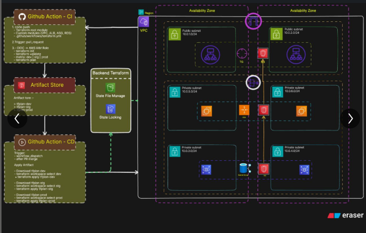

# 🚀 terraform-3tier-ci-cd

An end-to-end **Production-Grade 3-Tier AWS Infrastructure Project** built using **Terraform**, **GitHub Actions CI/CD**, and **AWS best practices**.

This project demonstrates how modern DevOps workflows can automate infrastructure provisioning, enforce deployment approvals, isolate environments, and deliver scalable cloud infrastructure using Infrastructure as Code.

---

# 📌 Project Overview

The main objective of this project is to build a **real-world 3-tier architecture** where infrastructure changes move through a **safe CI/CD pipeline** before reaching production.

Instead of manually creating AWS resources, the complete infrastructure is managed through Terraform and deployed through GitHub Actions.

### Core Focus Areas:

* **Infrastructure as Code (Terraform)**
* **CI/CD Automation**
* **Multi-Environment Deployment**
* **Remote State Management**
* **OIDC Authentication**
* **Approval-Based Production Deployment**
* **Scalable AWS Architecture**

---

# 🏗️ Architecture Diagram



---

# 🏗️ Solution Architecture

This project follows the architecture below:

**GitHub → GitHub Actions CI → Terraform Plan → Artifact Store → GitHub Actions CD → AWS Infrastructure**

### Infrastructure Flow:

**Users → ALB → Auto Scaling EC2 Instances → Database Layer**

---

# 🌐 3-Tier Architecture Breakdown

## 1️⃣ Presentation Layer

* **Application Load Balancer (ALB)**
* Hosted inside **Public Subnets**
* Multi-AZ traffic distribution
* Health checks for backend instances

---

## 2️⃣ Application Layer

* **EC2 Instances**
* Managed by **Auto Scaling Group**
* Hosted in **Private Subnets**
* NGINX installed through user-data

---

## 3️⃣ Data Layer

* Database hosted in **Private DB Subnets**
* Restricted access through **Security Groups**
* No public exposure

---

# ⭐ Key Architecture Features

* **Multi-AZ High Availability**
* **Auto Scaling**
* **Public / Private Subnet Isolation**
* **Secure Layer Communication**
* **Reusable Terraform Modules**
* **Environment Based Provisioning**

---

# 🌍 Multi-Environment Strategy

This project supports three isolated environments:

* **dev** → Development & testing
* **stg** → Pre-production validation
* **prod** → Live production

### Each Environment Uses:

* Same Terraform codebase
* Separate Terraform Workspace
* Independent Infrastructure
* Controlled CI/CD Deployment

---

# 🔁 CI/CD Pipeline (GitHub Actions)

## ✅ Continuous Integration (CI)

Triggered on **Pull Requests**

### CI Steps:

* Checkout Code
* Terraform Init
* Terraform Validate
* Terraform Plan

### Matrix Strategy:

* dev
* stg
* prod

### Plan Files Stored As Artifacts:

* `tfplan-dev`
* `tfplan-stg`
* `tfplan-prod`

👉 No infrastructure changes are applied during CI.

---

## 🚀 Continuous Deployment (CD)

Triggered via:

* `workflow_dispatch`
* After PR Merge

### Deployment Flow:

### Method 1: Approved Plan Apply

* Download approved tfplan artifact
* Select workspace
* Apply reviewed plan only

### Method 2: Controlled Plan + Apply

* Checkout repo
* Select workspace
* Terraform plan
* Terraform apply

### Manual Approvals Required:

* **staging**
* **production**

👉 Ensures safe deployments.

---

# 🔐 Security Practices

* GitHub Actions uses **AWS OIDC**
* No AWS Access Keys stored
* Temporary IAM Role credentials
* GitHub Environment Protection Rules
* Manual approvals for higher environments
* Private subnets for workloads and DB

---

# 📦 Terraform State Management

* Remote backend using **Amazon S3**
* State locking using **DynamoDB**
* Prevents state corruption
* Enables team collaboration

---

# ⚙️ Application Configuration

* NGINX installed using **user-data**
* Dynamic environment-based web page
* Same AMI reused across environments
* Terraform passes environment values

### Example Output:

* **DEV** → Green Theme
* **STG** → Yellow Theme
* **PROD** → Red Theme

---

# 📁 Repository Structure

```text
.
├── .github/workflows/       # CI/CD pipelines
├── modules/
│   ├── vpc/
│   ├── alb/
│   ├── asg/
│   └── rds/
├── backend.tf
├── variables.tf
├── outputs.tf
├── terraform.tfvars
└── README.md
```

---

# ⭐ Why This Project Is Production-Grade

* Highly available architecture
* Auto Scaling & fault recovery
* Deployment approvals
* Environment isolation
* Plan-before-apply workflow
* OIDC secure authentication
* Remote state + locking
* Modular Terraform structure

---

# 🛠️ Tech Stack

## Cloud

* AWS
* VPC
* EC2
* ALB
* Auto Scaling Group
* IAM
* S3
* DynamoDB
* RDS

## DevOps Tools

* Terraform
* GitHub Actions
* Linux
* NGINX

---

# 📚 Key Learnings

* Real CI/CD is more than just deploy scripts
* Safe production deployments need approvals
* Terraform state management is critical
* Auto Scaling improves resilience
* Environment separation reduces risk
* OIDC is better than static credentials

---

# 🔮 Future Improvements

* CloudWatch Monitoring & Alerts
* Security Scanning (tfsec / tflint / checkov)
* Route53 + HTTPS
* Drift Detection Pipeline
* Blue/Green Deployment
* Kubernetes Migration Path

---

# 💼 Resume-Friendly Summary

Built a production-grade 3-tier AWS infrastructure using Terraform and GitHub Actions with reusable modules, remote backend, environment-based deployments, approval gates, OIDC authentication, Auto Scaling, ALB, and secure database architecture.

---

# 👤 Author

**Sunil Chouhan**
DevOps Learner | Aspiring DevOps Engineer

---

# 📌 Final Note

This project focuses on **reliability, safety, scalability, and real-world DevOps practices** rather than just basic resource creation.
